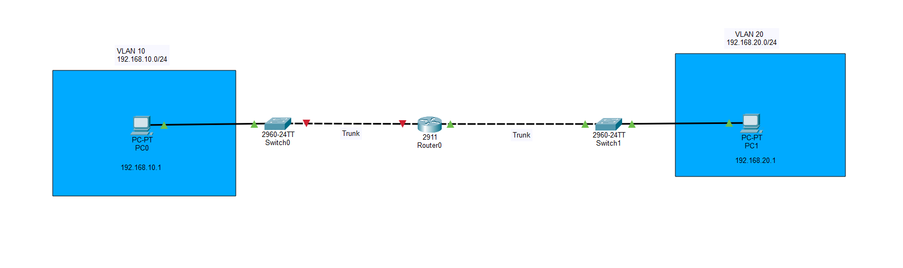

# Inter-VLAN Routing using Router-on-a-Stick

# SW0 Configuration
- Switch>enable
- Switch#configure terminal
## Create VLANs
- Switch(config)#vlan 10
- Switch(config-vlan)#name VLAN10
- Switch(config-vlan)#exit
- Switch(config)#vlan 20
- Switch(config-vlan)#name VLAN20
- Switch(config-vlan)#exit
## Access Prots
- Switch(config)#interface fa0/1
- Switch(config-if)#switchport mode access
- Switch(config-if)#switchport access vlan 10
- Switch(config-if)#exit
- Switch(config)#interface fa0/2
- Switch(config-if)#switchport mode access
- Switch(config-if)#switchport access vlan 20
- Switch(config-if)#exit
## Trunk Port to Router
- Switch(config)#interface fa0/3
- Switch(config-if)#switchport mode trunk
- Switch(config-if)#no shutdown
- Switch(config-if)#exit
- Switch(config)#end

# R0 Configuration
- Router>enable
- Router#configure terminal
## Sub-interface for VLAN 10
- Router(config)#interface g0/0.10
- Router(config-subif)#encapsulation dot1Q 10
- Router(config-subif)#ip address 192.168.10.1 255.255.255.0
- Router(config-subif)#no shutdown
- Router(config-subif)#exit
## Sub-interface for VLAn 20
- Router(config)#interface g0/0.20
- Router(config-subif)#encapsulation dot10Q 20
- Router(config-subif)#ip address 192.168.20.1 255.255.255.0
- Router(config-subif)#no shutdown
- Router(config-subif)#exit
## Trunk to SW1
- Router(config)#interface g0/1
- Router(config-if)#no shutdown
- Router(config-if)#exit
- Router(config)#end

# SW1 Configuration
- Switch>enable
- Switch#configure terminal
## Create VLANs
- Switch(config)#vlan 10
- Switch(config-vlan)#name VLAN10
- Switch(config-vlan)#exit
- Switch(config)#vlan 20
- Switch(config-vlan)#name VLAN20
- Switch(config-vlan)#exit
## Access Ports
- Switch(config)#interface fa0/2
- Switch(config-if)#switchport mode access
- Switch(config-if)#switchport access vlan 20
- Switch(config-if)#exit
## Trunk Port to Router
- Switch(config)#interface fa0/3
- Switch(config-if)#switchport mode trunk
- Switch(config-if)#no shutdown
- Switch(config-if)#exit
- Switch(config)#end

## PC IP Configuration
### PCO(VLAN 10)
- IP:192.168.10.10
- Mask:255.255.255.0
- Gateway:192.168.10.1
### PC1(VLAN 20)
- IP:192.168.20.20
- Mask:255.255.255.0
- Gateway:192.168.20.1
